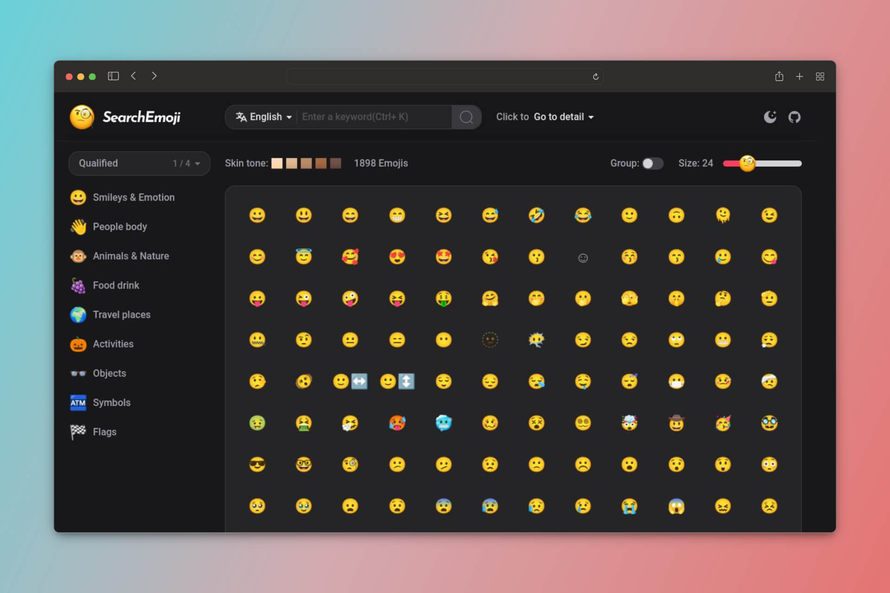

<h1 align="center">🧐 SearchEmoji</h1>
<p align="center">🔍Search for Emoji, 🖱️Click to Copy - Emoji Search Engine Supporting 30 Languages</p>

<p align="center"><a href="https://searchemoji.app/">👉 Visit Website</a></p>



Let Emojis bring your content to life. SearchEmoji houses the largest collection of emojis from around the world. Find exactly the emoji you need through powerful search functions—either search by keyword or browse through categories. Preview any emoji and copy it with one click into your documents, messages, and social posts.

## Emoji Data

Emoji data comes from [Unicode](https://unicode.org/Public/emoji/latest/emoji-test.txt), Multilingual names and keywords are generated by GPT-3.5-turbo. You can view the detailed generation code in the `/scripts` directory, or you can directly view the generated results in the `/data` directory.

## Contributing

The content generated by AI may be inaccurate. If you encounter problems or want to correct the name and keywords, you can submit an issue or submit a PR directly.

## Development

```bash
# install
pnpm install

# development
pnpm run dev

# build for production
pnpm run build
```
